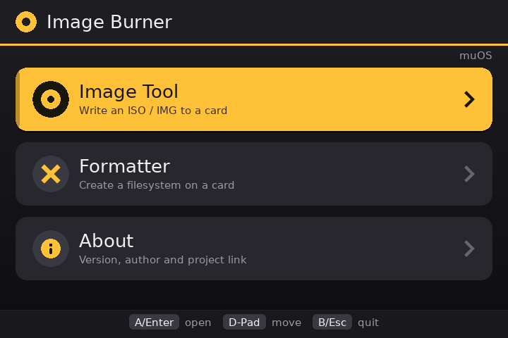
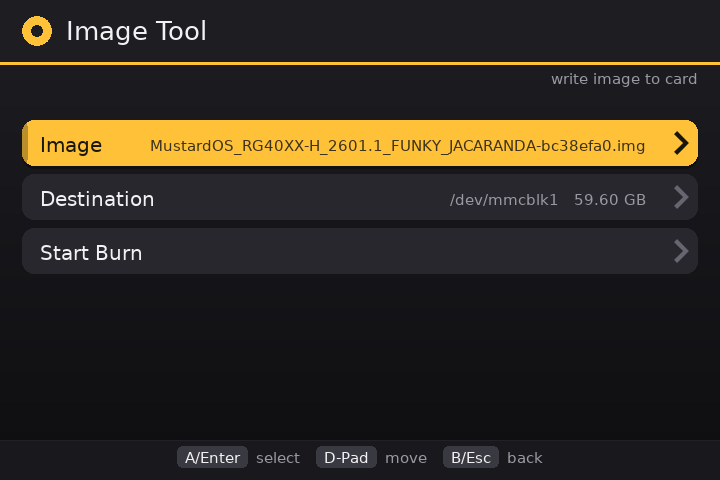
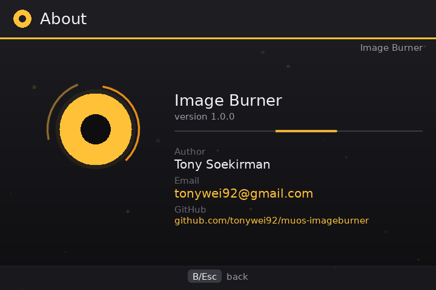
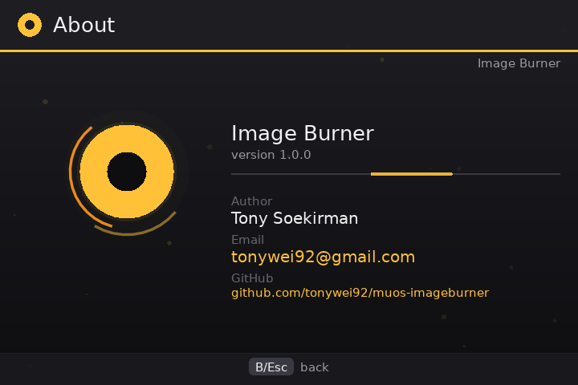

# Image Burner

Write disk images to an SD card, and format cards, right on your handheld — no PC
needed. Built for **MustardOS (muOS)** on Anbernic H700 devices (tested on the
**RG34XXSP**).

Everything is done with the D-pad and buttons, and it works on a normal muOS
install — nothing extra to set up.

## Screenshots

| Home | Image Tool |
| --- | --- |
|  |  |

| Formatter | About |
| --- | --- |
|  |  |

## What it can do

**Write images to a card**
- Pick an `.iso` or `.img` file, choose the card, and write it
- Compressed images work too (`.img.gz`, `.img.xz`) — no need to unpack them first
- Progress bar with write speed and time left
- Cancel any time; it tells you whether the card was finished or not
- Won't write to the card muOS is running from, or an image too big for the card

**Format a card**
- Formats: FAT12, FAT16, FAT32, exFAT, EXT2, EXT3 or NTFS
- Optional extras: cluster size and partition style (MBR, GPT, or none)
- Quick format, or a full format that wipes the whole card first
- Cancellable while it works

**Stays safe**
- The card muOS is running from is locked and can't be selected
- Nothing is erased without a confirmation screen

## Install

1. Download `ImageBurner-<version>.muxapp` from the
   [Releases page](https://github.com/tonywei92/muos-imageburner/releases/latest).
2. Copy it to the `ARCHIVE` folder on your card (SD1 or SD2).
3. On the device, open **Applications → Archive Manager**, select the file and
   install it.
4. Launch **Image Burner** from **Applications**.

## How to use

| Action | Button |
| --- | --- |
| Move | D-pad / arrows |
| Select / open | A / Enter |
| Change value | Left / Right |
| Back | B / Esc |

- **Burn an image:** Image Tool → Image → Destination → Start Burn → confirm
- **Format a card:** Formatter → Card → choose your settings → Start Format → confirm

## Compatibility

- Tested on Anbernic H700 handhelds (RG34XXSP) with muOS 2601.0 (Jacaranda)
- Should work on other muOS handhelds too — please share your results

> ⚠️ Formatting **erases the card you choose**. For burning, use a spare card too,
> and back up anything important first.

## Support

- Downloads: https://github.com/tonywei92/muos-imageburner/releases
- Report a bug or request a feature: https://github.com/tonywei92/muos-imageburner/issues

## License

Free and open source under the MIT License — see [LICENSE.md](LICENSE.md).

---

For developers: see [BUILD.md](BUILD.md) to build the app and its tools,
[DEVELOPMENT.md](DEVELOPMENT.md) for the architecture and testing, and
[CONTRIBUTING.md](CONTRIBUTING.md) to contribute.
